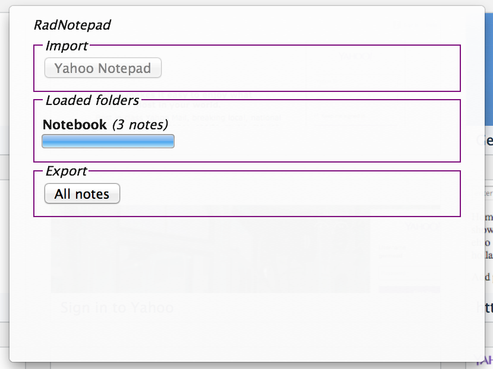
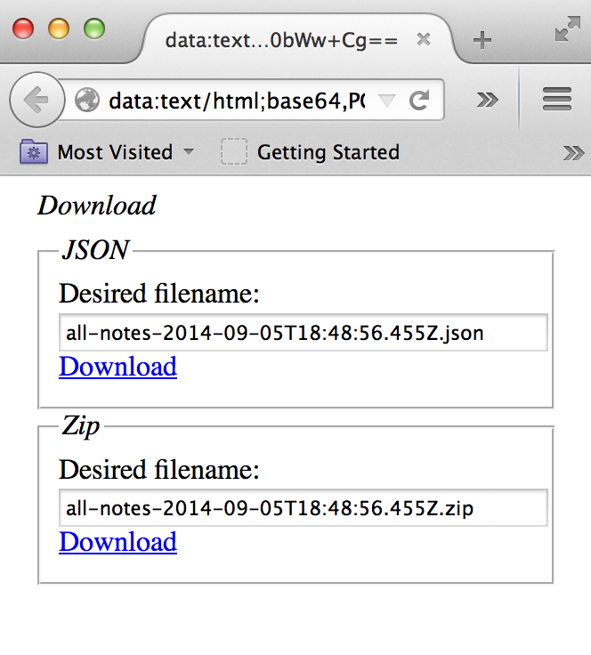

"Rad Notepad" Yahoo Notepad Exporter Firefox Addon
====

A Firefox restartless Addon that will call the same webservice endpoints that
the official Yahoo Notepad/Calendar web clients do to fetch all your notes,
and make them available to you as a raw JSON file, and as a .zip file
containing each note as an individual file.

How does this Addon authenticate with Yahoo?
----

Glad you asked! This Addon was designed to explicitly *not* require users to
enter their Yahoo credentials (username/password) in order for it to be able
to download your data. Instead, this Addon relies on you having logged in to
any of Yahoo's pages on your browser session, then any calls that this Addon
makes on your behalf will already contain your "logged in cookies" and just
work (tm).

User Guide
----

1.   Install the "Rad Notepad" Yahoo Notepad Exporter Firefox Addon.

2.   Make sure that you're already logged on to Yahoo (e.g. try to see if
you can open the Yahoo Notepad page without being prompted for a password).

3.   Click this extension's button, which should be on the browser's Toolbar.

4.   Click on the "Yahoo Notepad" button under the "Import" menu. This will
trigger the importing of all your Yahoo Notepad notes into the Addon (just
to memory without actually saving anything to any hard drives).

5.   Once the Addon is done fetching all your Yahoo Notepad notes, details
about your folders will appear on the "Loaded folders" menu, and the "All
Notes" button under the "Export" menu will become enabled.

6.   Upon clicking on the "All Notes" button under the "Export" menu, a new
browser tab will open that contains links to save your imported notes data
as either a raw JSON file, or as a .zip file containing one file per note.

*Tip*: On the download page, you can change the name of the file with your
notes that will be saved to your computer by changing the filename on the
provided form fields.
